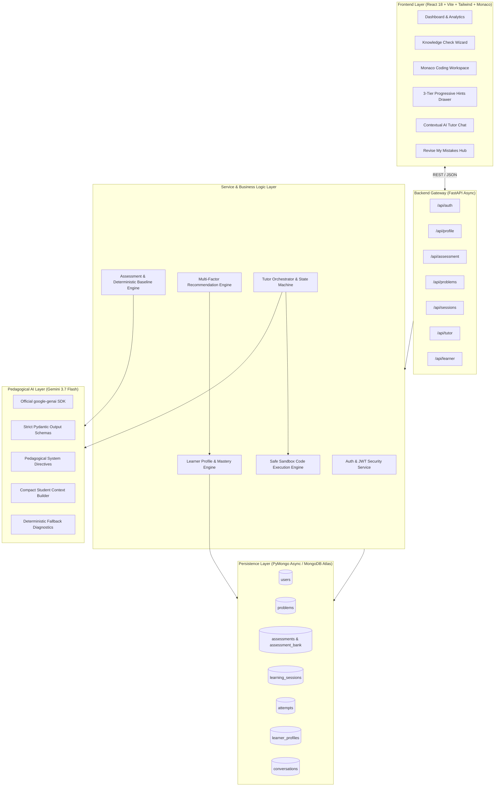
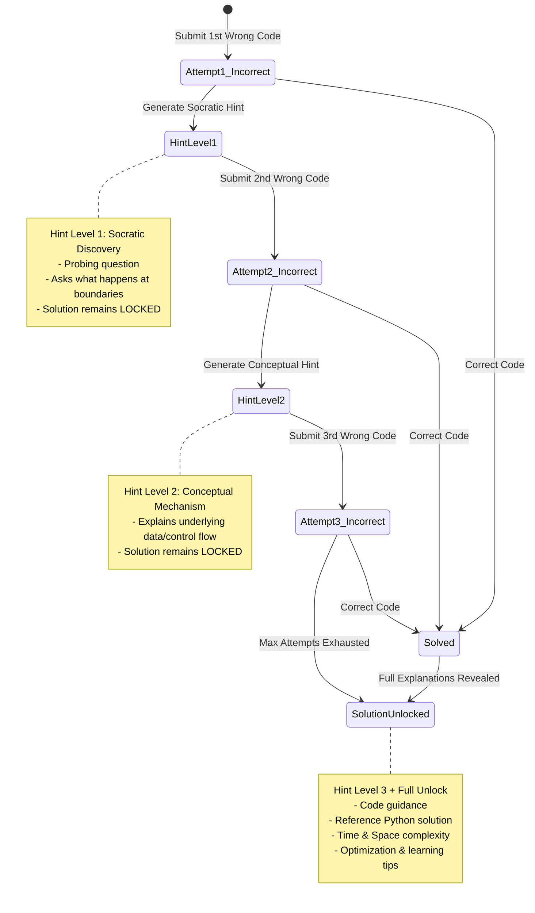

# CodeMentor AI - System Architecture & Engineering Specifications

## 1. Executive Summary

**CodeMentor AI** is an adaptive, pedagogically driven programming tutor designed to foster algorithmic problem-solving and deep concept comprehension rather than passive answer consumption.

The system is built on the foundational educational principle:
> **"Don't immediately solve the student's problem. First help the student discover the solution."**

---

## 2. High-Level Architecture

---

## 3. Server-Side Answer Locking Protocol

To guarantee that students cannot bypass the pedagogical discovery loop, answer locking is strictly enforced **server-side**:

1. **Problem Endpoint Masking**:
   - `GET /api/problems` and `GET /api/problems/{id}` unconditionally omit the fields `solution`, `explanation`, `better_approach`, `time_complexity`, and `space_complexity`.
2. **Session Attempt Guard**:
   - Every session starts with `solution_unlocked = false`, `attempts_allowed = 3`, and `attempts_used = 0`.
3. **Strict 403 Solution Endpoint**:
   - `GET /api/sessions/{session_id}/solution` executes an authorization check. If `solution_unlocked == false`, the server immediately responds with `403 Forbidden` (`SolutionLockedError`).
4. **Unlocking Conditions**:
   - **Independent / Hint Solve**: The student submits code passing all automated test cases (`solution_unlocked = true`, status = `solved_independently` or `solved_with_hints`).
   - **Exhausted Attempts**: The student utilizes all allowed attempts (`attempts_used >= attempts_allowed`), whereupon the backend transitions `solution_unlocked = true` and status = `exhausted`.

---

## 4. 3-Tier Progressive Hint State Machine

---

## 5. Deterministic Learner Profile & Mastery Algorithm

Concept mastery is computed deterministically to guarantee transparency, explainability, and reproducibility across student cohorts:

$$\text{Raw Mastery}(c) = 0.40 \cdot \text{Assessment}(c) + 0.30 \cdot \text{SuccessRate}(c) + 0.20 \cdot \text{IndSolveRate}(c) + 0.10 \cdot \text{RecentPerf}(c)$$

$$\text{Final Mastery}(c) = \max\Big(0.05, \min\big(0.99, \text{Raw Mastery}(c) - \text{MistakePenalty} - \text{HintPenalty}\big)\Big)$$

Where:
- $\text{MistakePenalty} = \min(0.20, \text{recurring\_mistakes}[c] \times 0.05)$
- $\text{HintPenalty} = \min(0.15, \frac{\text{hints\_used}}{\max(1, \text{attempts})} \times 0.05)$
- **Strong Topics**: $\text{Final Mastery}(c) \ge 0.70$
- **Weak Topics (Needs Practice)**: $\text{Final Mastery}(c) < 0.60$
